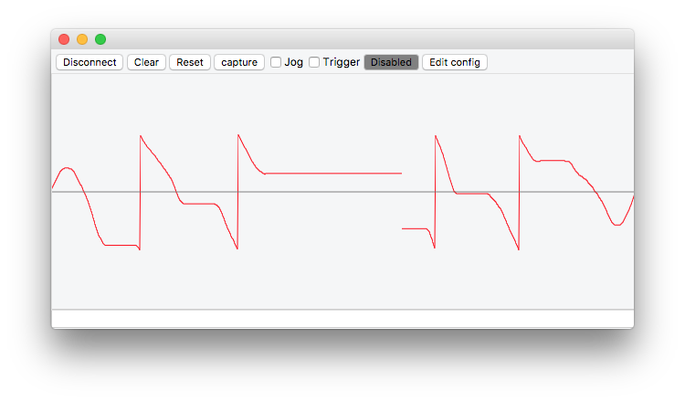
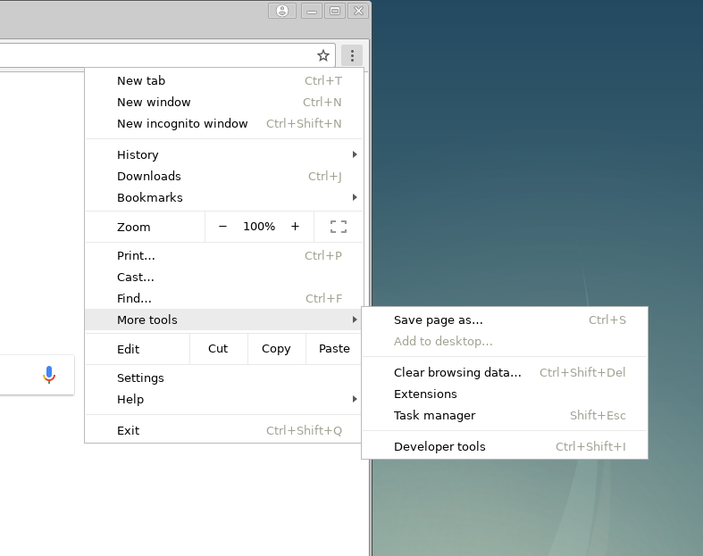
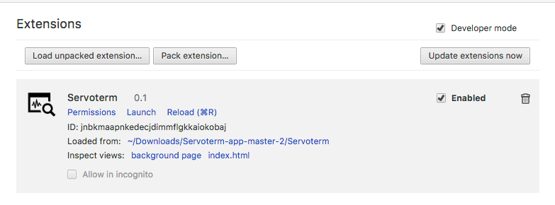
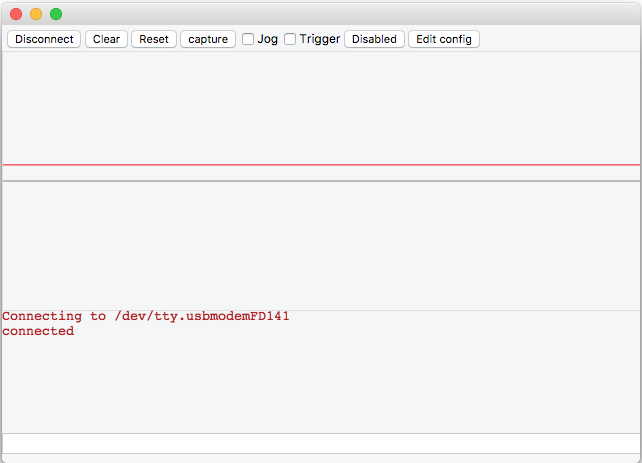

:lang: en

= STMBL Getting Started Guide

== Description

STMBL is a motor drive controlled by the STM32 microprocessor. It can 
power motors of up to 2.2kW and up to around 380V DC bus voltage. 

The name "STMBL" is based on the combination of the STM32 microprocessor
and BrushLess motor. However the drive is also capable of powering AC
induction or DC motors. The hardware is also capable of driving 3-phase
stepper motors.

The drive is configurable for a wide range of command and feedback types
through a hardware abstraction layer (HAL) analagous to that used by 
http://linuxcnc.org/docs/2.7/html/hal/intro.html[LinuxCNC]. 

Currently supported command interfaces are:

* Mesa Smart-Serial
* Step-Dir
* Quadrature
* Serial

+/-10V control is not supported, though the hardware capability exists.

Currently supported feedback interfaces are:

* Encoder
* Resolver
* sin/cos 1vpp
* Hall sensors
* Mitsubishi absolute encoder
* Yaskawa absolute encoder
* Sanyo Denki absolute encoder
* Fanuc serial encoder

The hardware has the capability to support other protocols like:

* EnDat
* BiSS
* SSI
* Modbus
* Profibus
* Hiperface
* CANopen

Encoder power is 5V by default but 12V can be selected by jumper pads on
the PCB. 

In addition to motor control and dual feedback each STMBL drive has two
+/-30V analogue inputs and three 24V / 2A digital outputs. 

To use the STMBL you will need to:

* connect your command, feedback and motor to STMBL using
<<Pinouts, suitable cables>>
* <<Flashing Firmware, flash the firmware>>
* configure the drive for your motor using <<Servoterm>> 
** configure your feedback interface
** find the correct <<Motor, parameters>> for your motor
** configure your command interface

== Anatomy of the STMBL

The STMBL consists of two separate PCBs that are made as one then 
assembled and split to be connected in the manner shown below. 
The vertical (top) board is the low-voltage (LV) board and this handles
the command, feedback and configuration tasks. The STM32F405
microprocessor is in charge of these tasks. 
The lower board is the high-voltage (HV) board and this is where the power driver is situated.
The only connection between the two boards is a serial connection
through a 2.5kV isolation IC. To make this possible there is a second
STM32 chip on the lower board. This is an STM32F303 and is referred to as
the "F3" in the remainder of this document. The processor on the upper
board is referred to as "F4".

image::images/ISO1.svg[]

The connectors on the HV board are 5.08mm and 3.5mm pitch. Those on the LV board
are 3.5mm pitch.  Mating part numbers are:

* HV Power: https://octopart.com/1757019-phoenix+contact-789[1757019]
* HV Motor: https://octopart.com/1757022-phoenix+contact-902[1757022] or
https://octopart.com/1792760-phoenix+contact-29279[1792760]
* LV Power and HV Temperatur: https://octopart.com/1840366-phoenix+contact-6675[1840366] or
https://octopart.com/1862852-phoenix+contact-118535[1862852]
* IO: https://octopart.com/1840405-phoenix+contact-14126[1840405] or
https://octopart.com/1862894-phoenix+contact-79205[1862894]

If preferred 2 x 3 position or 3 x 2 position plugs can be inserted in
the 6-position sockets. 

Logic power to the LV board should be 24V. A green LED will light
adjacent to the socket when power is supplied.

WARNING: The LV board is safe up to about 26V but take care that 0V is
common with the PC GND before connecting a USB cable. 

Motor power should be 30 to 350V, though the logic parts of the HV
board may work at 24V for firmware flashing etc. Again a green LED
adjacent to the connector confirms that the board is powered-up.

WARNING: The HV and LV boards are isolated in normal use but it is easy
to accidentally connect them. One way to do this is via USB cables which
can easily tie GND lines together through the setup PC. It is imperative
that the HV board should be powered from an isolated, low voltage supply when flashing firmware. 

The command and feedback connectors use standard 8P8C (RJ45) connectors
and standard CAT5 or CAT6 cables can be conveniently used. To connect
to cables with larger conductors than supported by CAT5 it is possible
to use, for example,
https://octopart.com/j00026a2001-telegärtner-24873031[Industrial CAT6a]
connectors which can accept core wires up to 1.6mm and overall cable
diameters up to 9.0mm.

Feedback 0 will typically be the encoder or resolver mounted on the
motor and feedback 1 can be used to connect either Hall sensors for
initial commutation or (potentially) scales mounted directly to the
axes. See the <<Pinouts>> section of this document for pin assigments
and typical wiring colour codes. 

The 6-way socket below the 24V logic power connector contains the three
digital outputs. These are current-sinking (switch-to-GND) and each is
adjacent to a 24V suppply pin. DIO0 (nearest the top) is the one that is
typically used to operate the holding brake on motors so-equipped. 

On the top of the drive are two analogue inputs, with 0V and 24V on
either side to that a active sensors can be connected. These are
typically used as variable-threshold digital inputs and are used, for
example, for axis limit switches. However it is relatively simple to
configure them for other uses in the HAL. 

Three LEDS on top of the unit indicate drive status. Red displays error
codes (using <<Blink Codes,blink codes>>). Amber indicates that all is well but the
drive is not enabled, and green shows that the drive is active and
operating normally. 

If no LEDs on the top of the board are illuminated, and the green power
LEDs near the power connectors _are_ illuminated then it is probably
necessary to <<Flashing Firmware, flash the firmware>>. If there are
LEDs lit on top of the drive then it is probably safe to assume that
firmware is loaded. 

== HAL (Hardware Abstraction Layer)

STMBL uses a data flow graph to configure the drive for
different types of motor, feedback and operation mode.
This is conceptually similar to the HAL in http://linuxcnc.org/docs/2.7/html/hal/intro.html[LinuxCNC] but the format and
commands are different. Also, all pins are floating point so no data
conversion is needed. 

An Application called <<Servoterm>> is used to interact with the HAL
interface and configure the drive. You will need to install and launch
this before it is possible to configure the STMBL.

STMBL HAL configuration does not use any commands other than the = sign
and the <<Servoterm Commands,servoterm commands>>

Assuming that there is already a motor connected to the drive and that
the drive it powered up the <<Servoterm>> display should already be
indicating the motor position feedback. Rotating the motor shaft by hand
might produce something like:

Though it equally well might not if the configuration is set up for a
resolver and the motor has an encoder. 

It should be possible to make the motor turn at this point without any
further configuration. The commands that follow will set the hv0 module
up to simply rotate the motor open-loop in direct-mode. (like a stepper
motor) with an excitation current of 0.5A. This should be safe for most
motors that the STMBL is a good match for, but you should choose your
own value. For an explanation of direct and quadrature current see the
section on <<Motor Basics#,motor control basics>>

`hv0.pos = sim0.vel`
`hv0.d_cmd = 0.5`
`hv0.en = 1`

The rotation speed can be altered by changing the sim0 frequency:

`sim0.freq = 5`

STMBL v4 HAL contains a number of components that have built-in linking
behaviour. 

== Resolvers
resolver phase - Setting the phase is very importatnt to get resolver output. 
'res0.phase = X' sets the phase. 
The number is between 0 and 1. Set for the highest output.
Resolver speed - In motor drives resolver speed is typically 1.
one rotation of the resolver = one rotation of the motor.
You will want to add these settings to the config,
so that the drive powers up with the settings as default.

== Motor pole count / setting motor feedback offset
Motor pole count in data sheets is often a total pole count rather
than stmbl required 'pole pair' count.
This is easy to see when running the com_test: type 'link com_test'
This should start the motor turning slowly in open loop, while displaying on the graph.
Ideally the green and black lines will match closely.
If they are not the same speed (same number of peaks) then the motor poles setting is wrong.
'conf0.polecount' can be set without stopping the test.
Set it till the number of green and black peaks are the same.
 
Now the peaks may be offset on the graph.
'conf0.motor_fb_offset' will set this. Adjust this number till the black and grean lines match.
You'll want to add these settings to the config so the drive starts with these defaults.

== Jogging test
If you set the jogging checkbox at the top of servo term and then enable the drive with:
'fault0.en = 1'
Then using the left and right cursor keys should jog the motor.
the escape key will disable the drive quickly if something is not quite right.
If there is a fault then you will need to toggle the enable pin to 0 and back to 1 again.
If the drive oscallates try adjusting the 'conf0.j' setting for inertia.
 
== Drive the motor with a sine wave ###
1. Connect it `rev0.in = sim0.msin`
2. Set amplitude `sim0.amp = 1` (in rad)
3. Set frequency `sim0.freq = 0.5` (in Hz)
4. Enable `fault0.en = 1`

== Or constant velocity ###
1. Connect it `rev0.in = sim0.vel`
2. Set frequency `sim0.freq = 0.5` (in Hz)
3. Enable `fault0.en = 1`

pressing esc at any time will disable the drive. to reenable, press reset or type `fault0.en = 0` followed by `fault0.en = 1`

== Servoterm

Servoterm (servo terminal) provides an interface which allows editing
of the drive HAL configuration. It also provides a rolling graphical
representation of any chosen parameter in the HAL which can be a great
aid to tuning and motor setup. 

Servoterm is supplied as a Google Chrome extension. This might seem
somewhat odd, but does provide for good cross-platform availability. 

Servoterm can be downloaded from https://github.com/STMBL/Servoterm-app[
this link].
Use the green button to download as a ZIP file and then extract on your
PC (Linux / Mac / PC). Open Google Chrome and click the three-dots icon
-> more-tools -> extensions.

[width=600, border]

Click
"developer mode" and then "Load Unpacked Extension". Then navigate to
the downloaded files and select the "Servoterm" folder. 
You should then be presented with the following, including an option to
launch the application.

[width=600]
[.thumb]

If you do not get the option to launch servoterm you can visit
link:chrome://apps[] and click on the servoterm logo.

To connect to the STMBL you will need a mini-USB B cable.

WARNING:Be sure that the 24V PSU is floating or shares a ground
reference with the PC.(Maybe even check the voltage between the
connector and socket before inserting the plug)

You can then click the "connect" button and you should get something
like the image below. <<Servoterm Connection Problems, what if I can
not connect>>

Taking the buttons from left to right:

* Connect / Disconnect - Should be fairly self-evident
* Clear - simply clears the screen
* Reset - Reenables the drive and clears faults. Does not reset the STMBL. To do that
type the <<Servoterm Commands,`reset`>> command
* Capture - Allows the output of the graphs to be saved and exported as CSV. First click starts the recording, second click stops and saves the file.
* Jog - when ticked the left-right arrow keys on the keyboard can be
used to jog the motor. 
* Trigger - stops the graph plot until the trigger condition is met.
* Trigger Status Indicator - not a button
* Edit Config - Brings up a sub-window in which the basic system config
can be edited. 

Other than the buttons described above the ramainder of servoterm (and
the STMBL HAL) is controlled by a command-line interface at the bottom. 

Servoterm uses the up and down arrow keys to scroll through previous
commands, but there is no tab-completion. 

This is mainly described in the <<HAL (Hardware Abstraction Layer),HAL>>
section of this document. 
The graphing display is controlled by the "term0" interface. Typing
`term0` at the prompt will show output similar to:

image::images/servoterm2.png[]

The first two entries are internal information about the HAL component
and can be ignored for now.
The next 8 lines say what internal signal each of the wave plots is
connected to. In this case wave0 (the black one) is connected to a sim
signal, in this case the sine wave. (as you might have guessed, typing 
"sim0" will show you the parameters of the simulated signals.)

To connect wave1 (red) to the sawtooth output (which simulates both
encoder feedback and a position command for steady rotation) then simply
type
`term0.wave1 = sim0.vel`
Each wave has an associated offset and gain parameter that can be used
to adjust vertical scale and position. The `term0.send_step` parameter
functions like the time-base of an oscilloscope. 

=== Servoterm Commands

The servoterm command list can be obtained at the command line by using
the `help` command. 

Commands to be used by the user:

* bootloader: enter bootloader
* reset: reset STMBL
* about: show system infos
* help: print this
* link: load config template
* hal: print HAL stats
* hv_update: update the F3 firmware
* show_config: show config templates
* show: show comps in flash
* list: show comp instances
* hv FOOBAR XYZ: send "FOOBAR XYZ" to the HV board

Commands for internal use:

* confcrc: Shows the CRC checksum of the loaded config. 
* flashloadconf: load config from flash
* flashsaveconf: save config to flash
* loadconf: parse config
* showconf: show config - pressing the `Edit config` button is better.
* appendconf: append string to config - also redundant with the config
editor
* deleteconf: delete config
* load: load comp from flash
* start: start rt system
* stop: stop rt system
* fault: trigger fault

=== Servoterm Connection Problems
https://github.com/rene-dev/stmbl/wiki/Development[]

= Flashing Firmware

=== Requirements to build firmware
The GCC cross-compiler for Arm:
gcc-arm-none-eabi-gcc https://launchpad.net/gcc-arm-embedded/+download

You will also need the STMBL source code, available from
https://github.com/rene-dev/stmbl
You can either clone this as a https://git-scm.com[git] archive or just
download a current snapshot as a zip file. 

In order for the STMBL Makefiles to be able to find the gcc binaries
you may need to create the file toolchain-user.mak to point to the correct
folder and version number.

=== Requirements to flash firmware
The STM32 chips have a built-in ROM bootloader, this means that it
should be impossible to "brick" the boards. Each of the two CPUs in the
STMBL drive needs both a dedicated bootloader to start the STMBL firmware
and the firmware itself.

==== Linux/Unix
To flash the boards with USB you will need the dfu-utils package http://dfu-util.sourceforge.net

To flash the boards with a stlink programmer over SWD you will need the stlink package https://github.com/texane/stlink

==== Windows
You will need the STM Virtual Comport driver to connect with Servoterm http://www.st.com/content/st_com/en/products/development-tools/software-development-tools/stm32-software-development-tools/stm32-utilities/stsw-stm32102.html   

And the DfuSe USB device firmware upgrade STMicroelectronics extension to flash the firmware over USB https://www.st.com/en/development-tools/stsw-stm32080.html

=== Checking for Existing Firmware - F4 board

Before flashing firmware it is worth trying to figure out if your board
is completely blank or has been pre-flashed with a bootloader or
firmware. 

If the board will connect with Servoterm then it already has a firmware
and STMBL bootloader. 
"about" will show the firmware information of the F4 board. "hv about"
will give the same information about the F3 board. Go to the 
<<Updating Firmware>> section to flash new firmware. 

If the board lights any LEDs other than the green power-good ones near
to the power input connectors then there is likely to already be a
firmware installed. Go to the 
<<Updating Firmware>> section if you need to update the firmware.  

If the board is powered with 24V to the LV board and connected with USB
to a PC then it will report as "STMBL Virtual ComPort:" in the Apple
System Profiler,  "ID 0483:5740 STMicroelectronics STM32F407" in lsusb
in Linux and "STMBL Virtual COM Port" in the Windows device manager if
there is a full firmware + STM32 bootloader installed. 

If the board shows "STM32 BOOTLOADER" (Mac) 
"0483:df11 STMicroelectronics STM Device in DFU Mode" (Linus lsusb) or
"STM32 BOOTLOADER" (Windows Device Manager) when powered up (without
using the boot pads) then this indicates that it already has an STMBL
bootloader. (though no harm is done by re-flashing this)

If the LV board does not show up at all on the USB bus then attempt to
put it in ROM boot mode by shorting the boot pads together while connection the 24V, you should
see "STM32 Bootlader" (Mac), "STMicroelectronics STM Device in DFU Mode"
(Linux lsusb) or "STM32 BOOTLOADER" (Windows Device Manager)
In this case you will need to flash both the STMBL bootloader and the
STMBL firmware. Go to the <<Flashing the LV board with no bootloader>> section.

=== Checking for existing firmware - F3 board

With 24V to the F3 board and with the F4 board _unpowered_ look at
the red LED under the fan, near the USB connector. 

If the HV board has both an STMBL bootloader and an STMBL Firmware
installed then it will illuminate only the green power LED and will flash
the red LED slowly to indicate no comms with the F4 board (which is
why this check should be done with the F4 board unpowered). Go to the
<<Updating Firmware>> section in this scenario. 

If the F3 board does not flash the red LED when the F4 is unpowered then
there is no bootloader and no firmware flashed. Go to the
<<Flashing the HV board with no bootloader>> section.

If the F3 board has only a bootloader flashed and no or broken firmware then the
red LED will flash rapidly. 
Use the instructions in <<Updating Firmware>> in this case. 

The boards can also be flashed with a SWD programmer, but that process
is not documented here. 

It can be convenient to flash the boards to test them before separating
the halves and before installing the IRAM module and bus capacitors if
you have a self-built or part-assembled board. 

Precompiled Binary versions of the firmware can be downloaded from
https://github.com/rene-dev/stmbl/releases

When compiling from the source code firmware flashing is handled by
specifying a makefile target for each of the firmware sections. 

=== Updating Firmware

The firmware on both the F3 and F4 board can be updated through the F4 USB
port and without access to the boot pads. 

Connect 24V to both the F3 and F4 boards.

In the source software folder type

 git pull
 
to get the latest software version

 make clean
 
to ensure that all files are freshened

 make
 make binall
 
to create the binary files to be flashed

 make btburn
 
to program the F4 firmware and transfer a copy of the F3 software or 

 make all_btburn
 
to program the F4 firmware + bootloader and transfer a copy of the F3 software (Warning: this will overwrite your config). 

There should then be a quantity of text output culminating with a
progress bar like:

 Downloading to address = 0x08000000, size = 2756
 Download	[=========================] 100%         2756 bytes

You can now re-connect with servoterm and check the firmware version with

 about
 
Updating the F3 firmware is done via Servoterm using the

 hv_update
 
command. This should give output similar to:

 hv_update: SEND_TO_BOOTLOADER
 hv_update: ERASE_FLASH
 hv_update: SEND_APP
 hv_update: status: 4%
 ...
 hv_update: status: 95%
 hv_update: CRC_CHECK
 hv_update: status: 100%
 hv_update: FLASH_SUCCESS
 hv_update: status: 100%
 hv_update: SLAVE_IN_APP
 
 If this fails multiple times go to the <<Flashing the HV board with no bootloader>> section.

=== Flashing the LV board with no bootloader

To flash the initial bootloader and firmware it is necessary to put the STM32 CPU
into ROM bootloader mode. You do this by shorting together the two pads
marked "boot" on the LV board while connection the 24V supply. 
This is a bit of a fiddle but should only need to be done once when
the board is first built. For the exact location of
these pads see the illustration in the <<Anatomy of the STMBL,Anatomy>>
section. Typically a small screwdriver can be used for this purpose. 
At this point the board should appear as an "STM32 Bootloader" in the 
USB tree of the attached PC. 

Follow the <<Updating Firmware>> instructions and use the 
 
  make all_btburn

command.

=== Flashing the HV board with no bootloader

Connect the USB cable to the HV board and short the
boot pads on the HV board while connection 24V to the HV input.
to put it into bootloader mode. Again it
should appear in the USB device tree. 

Follow the <<Updating Firmware>> instructions but use the 
 
  make f3_all_btburn

command.

### conf Pins ###
#### Motor ####
[Here is a quick tutorial to measure AC servo parameters](https://github.com/rene-dev/stmbl/wiki/motor-parameters)

* conf0.r phase-neutral resistance (ohm)
* conf0.l phase-neutral inductance (henry)
* conf0.j inertia (kg*m^2)
* conf0.psi torque constant (V*s/rad)
* conf0.polecount number of pole pairs
* conf0.max_vel max velocity (rad/s)
* conf0.max_acc max acceleration (rad/s^2)
* conf0.max_force max torque (Nm)
* conf0.max_ac_cur max AC current (A)

##### adc0.sin_offset adc0.cos_offset adc0.sin_gain adc0.cos_gain#####
Offsets and gains for analog inputs of FB0. Only needed for sin/cos or if high precision with resolvers is required.

== Motor parameters

Unfortunately servo motor datasheets often lack a good description of the parameters. There is a difference between line-to-line and phase values. Here are listed the most important motor parameters and how to determine them.

### resistance conf0.r (ohm) ###
1. measure line-to-line resistance R
2. convert to phase resistance conf0.r = R/2

### inductance conf0.l (henry) ###
1. measure line-to-line inductance L
2. convert to phase inductance conf0.l = L/2

If you can't measure this set it to 0.001/(phase resistance).

### moment of inertia conf0.j (kg*m^2) ###
1. read moment of inertia from datasheet

### polepair count conf0.polecount () ###
1. attach a power supply to the motor (limit the current)
2. turn the motor one rotation and count the number N of positions it snaps in conf0.polecount = N

### torque constant conf0.psi (V*s/rad) ###
The default value works for most motors. Normaly you don't have to measure this!
There is no common ground for the toque constant. Some manufacturers state the current in RMS, others in peak-to-peak. We also stumbled over values that were neither.

How to determine psi:

#### Scope ####
1. Drive motor at constant speed (lathe, power drill, ...)
2. Connect an oscilloscope between two phases and measure frequency F (Hz) and peak, line-to-line voltage U0 (V)
3. Convert to line-to-neutral voltage U1 = U0/sqrt(3)
4. Convert to amplitude U2 = U1/2
5. Convert to torque constant conf0.psi = U2/F/2.0/PI

#### STMBL ####
It's also possible to measure psi directly with STMBL. Maybe even automatically in a future version.

1. Disconnect the HV power, leave the servo connected.
2. Connect with Servoterm, drag&drop this file into Servoterm: https://github.com/rene-dev/stmbl/blob/master/conf/template/psi.txt
3. Type `stop` and  `start`
4. Turn the shaft of the motor. You can use your hand for a rough estimation, but it's probably better to drive with a cordless drill. The closer to the nominal RPM rating, the more accurate the result will be. There is no need to turn the shaft continuously, a quick short turn of one revolution is sufficient.
5. Type `psi0.max_psi` and you will get the peak psi value that was measured. You can set `conf0.psi` to the measured peak psi value now. If you did not drive the motor reasonably fast, the proper psi value is probably a couple percent higher.

#### KV ####
psi = 60.0 / #POLE_PAIRS / sqrt(3) / 2.0 / PI / KV

#### Nm/A ####
psi = (Nm/A) / 3.0 * 2.0 / #POLE_PAIRS

#### PID ####
The default values work for most motors. Normaly you don't have to tune this.
The STMBL PID works differnt than common PID loops. Understand the https://github.com/rene-dev/stmbl/blob/master/shared/comps/pid.c[code] and it's interaction with the https://github.com/rene-dev/stmbl/blob/master/shared/comps/pmsm_limits.c[motor model] first!

* conf0.pos_p position pid proportional gain (1/s)
* conf0.vel_p velocity pid proportional gain (1/s)
* conf0.vel_i velocity pid integral gain
* conf0.cur_p current pid proportional gain (V/A)
* conf0.cur_i current pid integral gain
* conf0.cur_ff current pid resistance feedforward gain
* conf0.cur_ind current pid BEMF feedforward gain

#### Command ####
* conf0.cmd_rev command reverse
* conf0.cmd_res command resolution (1/rev)

#### Limits ####
Exceeding a limit results in an action.

* conf0.max_dc_volt voltage limit (V):  disable drive
* conf0.high_dc_volt brake resistor limit (V) : activate brake resistor (Note: there is no build in brake resistor in STMBL V3 or V4)
* conf0.low_dc_volt voltage limit (V): disable drive
* conf0.max_hv_temp temperature limit (°C): disable drive
* conf0.high_hv_temp temperature limit (°C): reduce max current
* conf0.fan_hv_temp temperature limit (°C): activate fan
* conf0.max_pos_error max positon error (rad): disable drive
* conf0.max_sat max saturation time (s): disable drive

== Pinouts

=== Command connector wiring:

|===
|Pin |Colour |Smart Serial |Step/Dir |Quadrature

|1 |Orange Stripe |RX+ |Step+ |A+
|2 |Orange        |RX- |Step- |A-
|3 |Green Stripe  |TX+ |Dir+  |B+
|4 |Blue          |    |Err-  |   
|5 |Blue Stripe   |    |Err+  |   
|6 |Green         |TX- |Dir-  |B- 
|7 |Brown Stripe  |    |Enbl+ | 
|8 |Brown         |    |Enbl- | 
|===

=== Feedback connector wiring - encoders etc

|===
|Pin |Colour |Resolver |Encoder |1Vpp |UVW |Mitsubishi |Sanyo-Denki |Yaskawa |Omron 

|1 |Orange Stripe |Sin+ |A+  |Sin+ |U+  |    |      |  |
|2 |Orange        |Sin- |A-  |Sin- |U-  |    |      |  |
|3 |Green Stripe  |Cos+ |B+  |Cos+ |V+  |    |      |  |
|4 |Blue          |Ref- |Z-  |     |W-  |2   |Blue  |6 |4 
|5 |Blue Stripe   |Ref+ |Z+  |     |W+  |1   |Brown |5 |7 
|6 |Green         |Cos- |B-  |Cos- |V-  |    |      |  |
|7 |Brown Stripe  |AIN  |VCC |VCC  |VCC |VCC |Red   |1 |6 
|8 |Brown         |GND  |GND |GND  |GND |GND |Black |2 |3 
|===

=== Connector wiring - serial protocols

|===
|Pin |Colour|RS485 |RS422 |UART |USART |UART HD |USART HD |SPI |SPI HD

|1 |Orange Stripe |    |A   |RX+ |RX+  |       |       |MISO+ |CS+ 
|2 |Orange        |    |B   |RX- |RX-  |       |       |MISO- |CS- 
|3 |Green Stripe  |    |    |    |CLK+ |       |CLK+   |CLK+  |CLK+ 
|4 |Blue          |B   |Z   |TX- |TX-  |TX/RX- |TX/RX- |MOSI- |MOSI-
|5 |Blue Stripe   |A   |Y   |TX+ |TX+  |TX/RX+ |TX/RX+ |MOSI+ |MOSI+
|6 |Green         |    |    |    |CLK- |       |CLK-   |CLK-  |CLK- 
|7 |Brown Stripe  |VCC |VCC |VCC |VCC  |VCC    |VCC    |VCC   |VCC  
|8 |Brown         |GND |GND |GND |GND  |GND    |GND    |GND   |GND  
|===

== linuxcnc
STMBL supports Mesa Smartserial to communicate with LinuxCNC. http://linuxcnc.org/docs/html/man/man9/sserial.9.html

https://www.youtube.com/watch?v=5CKMrOy0ZXk

# Version 3 #
Version 3 can connect via rj45 to our db25 bob: https://github.com/rene-dev/stmbl/tree/master/hw/kicad/bob/db25_bob

It plugs into any DB25 mesa card, and provides full isolation.

Supported are 5i25, 6i25, 7i92, 7i80DB, 7i76E.

To use stmbl with 7I74 or 7I44 you need to make a custom cable.

|===
| Mesa               | STMBL              |

| 1 Orange stripe    | 2 Orange           |
| 2 Orange           | 1 Orange stripe    |
| 3 Green stripe     | 5 Blue stripe      |
| 6 Green            | 4 Blue             |
|===

# Version 4 #
Version 4 can plug directly into a 7I74 or 7I44.

# STMBL config
    # At the end of your STMBL config, load sserial:
    link sserial

    # set the scale
    linrev0.scale = 5
# Example: HAL config for Position mode with Position feedback ##

This is an example for one axis, Mesa 5i25 and one stmbl board, added to a .hal file in a machine config:

    # This is an example for linuxcnc hal in position mode for the x-axis:
    net xposcmd joint.0.motor-pos-cmd  => hm2_5i25.0.stbl.0.0.pos_cmd
    net xvelcmd joint.0.vel-cmd        => hm2_5i25.0.stbl.0.0.vel_cmd
    net xposfb  joint.0.motor-pos-fb  <=  hm2_5i25.0.stbl.0.0.pos_fb
    net xenable joint.0.amp-enable-out => hm2_5i25.0.stbl.0.0.enable
    net xfault  joint.0.amp-fault-in  <=  hm2_5i25.0.stbl.0.0.fault
    net xindex  joint.0.index-enable  <=> hm2_5i25.0.stbl.0.0.index_enable

# Example: Full Machine Config with STMBL boards, Mesa 7i80, Mesa 7i77, Analog Outputs, Encoder Inputs

See <https://github.com/aShure/cnc-configs/tree/master/justinbieber>

== Blink Codes
=== F4 Board
1. Normal Operation
 * No Error (Green LED on top illuminated. Good!)
 * Drive disabled (Yellow LED on top. Drive ready to go but disabled.)
 * Autophasing (Green and Yellow)
2. Errors
 * Soft fault, resettable (Red LED blinks according to the list below)
 * Hard fault, bad! (All LEDs on top blink.)

Count the number of blinks of the red LED. Each number indicates a
different class of faults. 

1. Command Error. Common during setup. Only really relevant to smart-serial
2. Motor Feedback Error
3. Commutation Feedback Error
4. Joint Feedback Error
5. Position Error
6. Saturation Error
7. Motor temperature high
8. HV Board serial CRC Error
9. HV Board comms Timeout Error
10. HV Board over-temperature
11. HV Voltage out of range
12. HV Board Fault
13. HV current offset fault
14. HV Overcurrent RMS
15. HV Overcurrent Peak
16. HV Overcurrent HW

=== F3 Board
1. Normal operation
 * Green LED at power input
2. Errors
 * Red LED under fan blinks fast - Bootloader but no or broken firmware
 * Red LED under fan blinks slow - No communication with F4
 * Red LED under fan does not blink _AND_ F4 not plugged in - No firmware or bootloader

== Specs 
=== PCB Version 4
|===
| connector | abs. MIN | MIN | TYP | MAX | abs. MAX | unit | note |

| 24V       | 0        | 15  | 24  | 25  | 26       | V    |      |
| 24V       |          |     | 0.2 | 3   | 6        | A    | 1    |
| HV        | 0        | 24  | 320 | 380 | 400      | V    |      |
| HV        | -28      | -17 |     | 17  | 28       | A    | 2    |
| CMD       | -7       | 0   |     | 5   | 12       | V    |      |
| CMD       | -250     | -50 |     | 50  | 250      | mA   |      |
| FB VPP    | 0        | 0   |     | 12  | 24       | V    |      |
| FB VPP    | 0        | 0   | 500 | 1000| 1500     | mA   |      |
| FB diff.  | -7       | 0   |     | 5   | 12       | V    |      |
| FB diff.  |          | -1.2|     | +1.2|          | Vpp  | 3    |
| FB        | -250     | -50 |     | 50  | 250      | mA   |      |
| output    | 0        | 0   |     | 24  | 26       | V    |      |
| output    | 0        | 0   |     | 1   | 2        | A    |      |
| input     | -36      | -24 |     | 24  | 36       | V    |      |
| IO        | 0        | 0   |     | 5   | 5        | V    |      |
| UVW       | 0        | 0   |     | 380 | 400      | V    |      |
| UVW       | -30      | -28 |     | 28  | 30       | A    |      |
| UVW avg.  |          | -17 |     | 17  |          | A    | 2    |
|===

note 1: depends on brake, fan and encoder consumption  

note 2: depends on PCB and driver cooling  

note 3: for analog input
